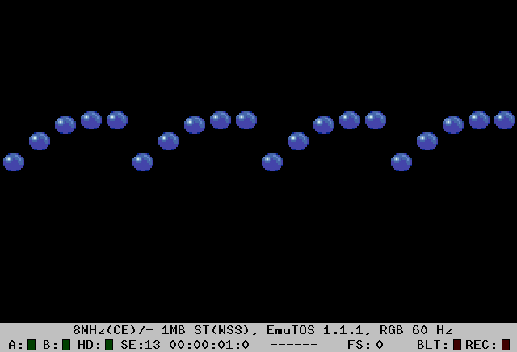
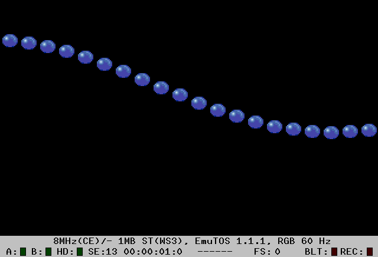

Manyballs
=========

Vertically sine-wave animated sprites, using a pre-calculated table for
Y-coordinates.

This small program was initially built using only 1 sprite, and in this
version replicated to 20 sprites, in a _brute force_ manner. I remember
capitulating to this simple solution, but it was still fun to see the results.

Each sprite is individually offset, and follows the pre-caluclated sine-wave.
This could easily be experimented with by changeing the offsets.

